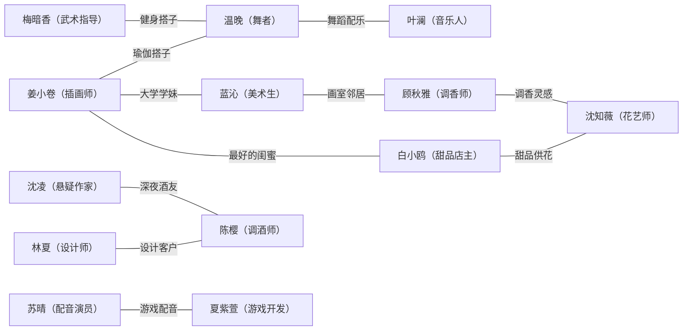

<!-- 文档同步自 https://github.com/chenweidu666/CineMaker-AI-Platform 分支 main — 请勿手工与上游长期双轨编辑 -->

# AI女孩图鉴 · 角色总览

> 13位女孩，13种人生。每人一支5秒PV，一个场景，一句台词，一个动作。

---

## 角色关系网络

---

## EP01 · 姜小卷

| 项目 | 内容 |
|------|------|
| **姓名** | 姜小卷 |
| **年龄** | 24 |
| **职业** | 咖啡师 / 独立插画师 |
| **星座 · MBTI** | 双鱼座 · INFP |
| **性格标签** | 慢热、爱发呆、细节控、嘴硬心软 |
| **一句话人设** | 用画笔记录生活碎片的咖啡女孩 |
| **代表色** | 奶白+薄荷绿 |
| **voice_style** | 温柔略带慵懒的少女音，语速偏慢，尾音微微上扬 |
| **剪映配音** | 搜索「温柔学姐」或「邻家女孩」，音色清亮偏软、语速偏慢、有轻微气声感 |
| **推荐BGM** | 轻快原声吉他+轻钢琴，治愈日常感。搜索：`lofi cafe bgm`、`日系治愈钢琴` |

**背景故事**：美术学院毕业后没有进设计公司，而是在梧桐路的咖啡馆做兼职咖啡师，空闲时间画插画接稿。租了一间小公寓独居，冰箱贴满便签和拍立得，窗台养了一盆永远长不大的多肉。做饭永远咸，瑜伽永远摔，但手账画得比谁都认真。

**小癖好**：①咖啡只喝自己拉花的 ②睡前必须写手账才能入睡 ③紧张时会咬笔帽

**口头禅**：「完美。」（对一切刚刚好的小事）

### PV 分镜（5s）

- **场景**：街角咖啡馆吧台 ｜ **造型**：姜小卷-通勤装 ｜ **景别**：近景→特写

**首帧**：近景，温暖灯光的咖啡馆吧台后方，穿米色针织开衫搭白色T恤的深棕色蓬松短卷发女孩低头专注往咖啡杯里倒奶泡，银色星星耳钉在灯光下微闪，棕色大眼睛认真盯着杯面。

**过程**：穿米色开衫的短卷发女孩手腕猛地一沉一提，奶泡精准注入杯面画出一条弧线，手指快速微调角度，细线勾出猫耳轮廓。紧接着手腕连续两次短促抖动，在猫脸上点出眼睛和胡须，奶泡在杯面划出细密的纹路。她果断收住奶缸，杯面上一只完整的猫咪成形。放下奶缸的瞬间，银色星星耳钉随动作一晃，她歪头凑近杯面端详，棕色眼睛逐渐亮起来，嘴角不自觉弯成满足的弧度，轻声说：「有些画只能活三分钟——但它值得。」

**尾帧**：特写，咖啡杯面上精致的猫咪拉花图案，蒸汽袅袅，背景虚化中短卷发女孩嘴角上扬的侧脸。

**台词**：「有些画只能活三分钟——但它值得。」
**语气**：轻声、温柔、带一丝感伤和珍惜

**小红书标题**：她在咖啡杯上画了只猫 然后猫消失了☕🐱
**小红书简介**：
姜小卷 24岁 咖啡师兼插画师
美院毕业没进设计公司 在街角咖啡馆拉花
手账画得比谁都认真 咖啡只喝自己拉花的
手腕一沉一提 杯面上勾出一只完整的猫
她说：有些画只能活三分钟——但它值得。
三分钟后这只猫就被喝掉了😭

#AI女孩图鉴 #角色介绍 #咖啡拉花 #插画师 #治愈

---

## EP02 · 白小鸥

| 项目 | 内容 |
|------|------|
| **姓名** | 白小鸥 |
| **年龄** | 25 |
| **职业** | 甜品店店主 |
| **星座 · MBTI** | 巨蟹座 · ESFJ |
| **性格标签** | 暖心、话多、爱操心、甜食治愈论信徒 |
| **一句话人设** | 相信甜的东西能治好一切的阳光女孩 |
| **代表色** | 淡黄+奶油白 |
| **voice_style** | 明亮温暖的邻家女孩音，语速中等，笑意常驻 |
| **剪映配音** | 搜索「甜美女声」或「浙音甜妹」，音色甜软、带微笑感、语速中等 |
| **推荐BGM** | 轻快尤克里里+轻拍手节奏。搜索：`cute bakery music`、`甜品店背景音乐` |

**背景故事**：从小就爱泡在厨房里，大学学的食品工程，毕业后顶着家人反对开了一间迷你甜品店「小鸥的厨房」。店面只有20平米，但每一款蛋糕都是自己研发的配方。开业第一年亏了钱，第二年靠口碑做到了预约制。是姜小卷从高中起的好闺蜜，两人的友谊从一块分着吃的草莓蛋糕开始。

**小癖好**：①尝完甜品会闭眼三秒品味 ②随身带保鲜袋装试吃品 ③拍甜品照片时必须调到俯拍45度

**口头禅**：「甜的东西能治好一切。不行就吃两份。」

### PV 分镜（5s）

- **场景**：甜品店操作台 ｜ **造型**：白小鸥-碎花裙（外加围裙） ｜ **景别**：中景→近景

**首帧**：中景，粉白色调的甜品店操作台前，穿淡黄色碎花连衣裙外系白色围裙的乌黑波浪卷发女孩手持裱花袋，珍珠耳坠轻轻晃动，大眼睛专注地盯着面前的蛋糕，指尖稳定地挤出奶油。

**过程**：穿碎花裙的波浪卷发女孩握紧裱花袋，手腕稳定地一旋一提，在蛋糕顶部挤出第一圈花瓣，紧接着调整角度连续三次快速挤压，奶油层层叠起成玫瑰花形。她果断收住裱花袋末端，一朵完整的奶油玫瑰在蛋糕上绽开，珍珠耳坠随着收手的动作轻轻一晃。放下裱花袋，忍不住伸出食指飞快沾了一点奶油送进嘴里，大眼睛瞬间眯成月牙，肩膀放松下来，满足地笑着说：「每一口甜，都是我偷偷藏进去的好心情。」

**尾帧**：近景，穿碎花裙的女孩嘴角沾着一点奶油，大眼睛弯成月牙笑，面前蛋糕上的奶油玫瑰精致漂亮。

**台词**：「每一口甜，都是我偷偷藏进去的好心情。」
**语气**：满足、温暖、像在分享一个小秘密

**小红书标题**：裱完花偷吃一口奶油的甜品店老板娘🍰
**小红书简介**：
白小鸥 25岁 甜品店店主
顶着家人反对开了间20平米的店
每一款蛋糕都是自己研发的配方
裱花袋一旋一提 蛋糕上开出一朵奶油玫瑰
然后偷偷沾了一口送进嘴里
她说：每一口甜 都是我偷偷藏进去的好心情。
姐姐你这是在偷吃库存吧🤣

#AI女孩图鉴 #角色介绍 #甜品 #蛋糕 #裱花

---

## EP03 · 蓝沁

| 项目 | 内容 |
|------|------|
| **姓名** | 蓝沁 |
| **年龄** | 21 |
| **职业** | 大学生 / 美术系大三 |
| **星座 · MBTI** | 白羊座 · ENFP |
| **性格标签** | 元气、冲动、自来熟、社交恐惧绝缘体 |
| **一句话人设** | 永远精力过剩的美术系小太阳 |
| **代表色** | 红色+白色 |
| **voice_style** | 元气爆棚的少女音，语速快，音调偏高，带笑意 |
| **剪映配音** | 搜索「元气少女」或「活力女声」，音色明亮有爆发力、语速偏快、带上扬尾音 |
| **推荐BGM** | 节奏感强的电子流行+欢快鼓点。搜索：`indie pop energetic`、`元气少女BGM` |

**背景故事**：从小就是班里最闹腾的那个，高中在画室集训时认识了大她三届的姜小卷学姐，从此成为甩不掉的跟屁虫。现在美术系大三，画风极其大胆前卫，导师说她"有才但坐不住"。在学校附近合租，室友已经习惯了她凌晨三点还在涂颜料。

**小癖好**：①指甲缝永远有洗不掉的颜料 ②见到好看的颜色会立刻拍照存色号 ③笑的时候喜欢拍桌子

**口头禅**：「哇这个颜色绝了！！」

### PV 分镜（5s）

- **场景**：大学画室 ｜ **造型**：蓝沁-周末休闲 ｜ **景别**：中景

**首帧**：中景，阳光充足的大学画室，四周立着画架和颜料瓶，穿白色宽松露肩卫衣搭牛仔短裤的黑色长波浪卷发女孩站在画面中央一幅大画布前，左手端着调色板，右手持画笔，金色圈形耳环随动作晃动，白色衬衫袖口和牛仔裤上都沾着五颜六色的颜料。

**过程**：穿露肩卫衣的长波浪卷发女孩猛地抬臂，画笔蘸满鲜红颜料朝画布大力一甩，颜料飞溅在白色画布上炸开一片。她随即换手抓起另一支笔蘸靛蓝色，手腕一转在红色旁边刷出一道粗犷的弧线，金色圈形耳环随着挥臂动作剧烈晃动。退后一步歪头审视，调色板在左手里歪斜着差点滑落，她下意识一接稳住，大眼睛亮了亮，兴奋地一拍大腿，张嘴大笑喊：「管它像不像——我开心就行！」

**尾帧**：穿露肩卫衣的长波浪卷发女孩从挥笔变为退后一步张大嘴笑，调色板歪在手里，脸上不知什么时候蹭了一道蓝色颜料，画布上那一笔鲜红色格外醒目。

**台词**：「管它像不像——我开心就行！」
**语气**：兴奋、大声、理直气壮的快乐

**小红书标题**：这个美术生画画全靠甩🎨
**小红书简介**：
蓝沁 21岁 美术系大三
从小就是班里最闹的那个 导师说她有才但坐不住
指甲缝永远有洗不掉的颜料
蘸满红色颜料朝画布大力一甩 又换蓝色刷一道
退后看了一眼 拍着大腿大笑
她说：管它像不像——我开心就行！
脸上不知道什么时候蹭了一道蓝颜料都不知道😂

#AI女孩图鉴 #角色介绍 #美术生 #画画 #元气少女

---

## EP04 · 温晚

| 项目 | 内容 |
|------|------|
| **姓名** | 温晚 |
| **年龄** | 26 |
| **职业** | 现代舞舞者 / 舞蹈工作室主理人 |
| **星座 · MBTI** | 天秤座 · ISFP |
| **性格标签** | 慵懒、优雅、看似冷淡实则温柔、猫系人格 |
| **一句话人设** | 在音乐里自由落体的慵懒舞者 |
| **代表色** | 米杏+金色 |
| **voice_style** | 低沉慵懒的知性女声，语速很慢，气声感强，像在耳边说话 |
| **剪映配音** | 搜索「懒洋洋小姐姐」或「慵懒御姐」，音色低沉有磁性、气声重、语速很慢 |
| **推荐BGM** | 慢节奏现代舞曲+大提琴。搜索：`contemporary dance slow`、`dark elegant cello` |

**背景故事**：从五岁开始学芭蕾，十六岁转现代舞，二十三岁在一条弄堂里开了自己的工作室。白天教课，晚上独自在空旷的舞房里即兴。朋友圈从不发自拍，只发脚尖和光影。和姜小卷是同一栋楼的邻居，两人在楼道里碰到过几十次才正式说上话，现在是可以不敲门直接进门的关系。

**小癖好**：①走路永远脚尖先着地 ②雨天必须出门淋一会儿 ③和人说话时会下意识伸展手指

**口头禅**：「……还行。」（实际上是很高的评价）

### PV 分镜（5s）

- **场景**：舞蹈工作室 ｜ **造型**：温晚-舞蹈练功服 ｜ **景别**：全景→近景

**首帧**：全景，空旷的舞蹈工作室，一面墙是落地镜，木质地板反射着暖色夕阳光线。穿黑色无袖紧身舞蹈上衣搭黑色高腰宽松舞蹈裤的黑色长直发女孩赤脚站在画面中央，长发扎成低马尾，丹凤眼微闭，双臂自然垂在身侧，细金锁骨链在夕光中闪了一下。

**过程**：穿黑色舞蹈服的长直发女孩右臂猛然抬起，手指逐根展开划过空气，身体向右侧倾，低马尾发尾甩过裸露的肩膀。赤脚踮起脚尖，左腿向后抬起成阿拉贝斯克舞姿，双臂如翅膀展开，锁骨链闪了一下。身体迅速回收，借惯性完成一个流畅的旋转，舞蹈裤裤脚带起微风，黑发在空中划出弧线。旋转未停，顺势向前迈出一个深弓步，上身后仰，双臂向两侧打开成十字，露出修长的脖颈线条。随即弹起，连续两个快速的侧身旋转，赤脚在木地板上无声划过，最后猫一样地收势——右脚脚尖点地，左手下意识舒展手指，丹凤眼半睁，歪头看了一眼落地镜中的剪影，嘴角浮起一个不经意的弧度，用气声般的低音说：「这支舞，只跳给影子看。」

**尾帧**：近景，穿黑色舞蹈服的长直发女孩舞姿收束定格，右脚脚尖点地，左手手指自然舒展，丹凤眼慵懒含笑，夕阳光线在落地镜中映出她优美的剪影，细金锁骨链在颈窝微微发光。

**台词**：「这支舞，只跳给影子看。」
**语气**：慵懒、低沉气声、带一丝孤傲和自得

**小红书标题**：空舞房 赤脚 一个人跳到天黑🩰
**小红书简介**：
温晚 26岁 现代舞舞者
五岁学芭蕾 十六岁转现代舞 自己开了工作室
朋友圈从不发自拍 只发脚尖和光影
赤脚在空舞房连转两圈 收势时脚尖轻点地
歪头看了一眼镜子里的影子
她说：这支舞 只跳给影子看。
走路都脚尖先着地的人果然不一样🐱

#AI女孩图鉴 #角色介绍 #现代舞 #舞者 #慵懒

---

## EP05 · 沈知薇

| 项目 | 内容 |
|------|------|
| **姓名** | 沈知薇 |
| **年龄** | 28 |
| **职业** | 花艺师 / 独立花艺工作室主理人 |
| **星座 · MBTI** | 金牛座 · ISFJ |
| **性格标签** | 温柔、执拗、完美主义、手比嘴快 |
| **一句话人设** | 在花丛中迷路的温柔完美主义者 |
| **代表色** | 草绿+浅粉 |
| **voice_style** | 温柔沉静的女声，语速适中，咬字清晰，像在讲睡前故事 |
| **剪映配音** | 搜索「知性姐姐」或「温柔旁白」，音色柔和有质感、语速慢、咬字轻柔 |
| **推荐BGM** | 法式手风琴+轻弦乐，花园午后氛围。搜索：`french cafe accordion`、`garden ambient` |

**背景故事**：园林专业毕业后去日本学了两年池坊花道，回国后在梧桐路尽头开了一间花艺工作室「微·知」。店面被绿植和鲜花包围，路过的人经常误以为是个小花园。性格温柔但对花材极其较真，一枝玫瑰的角度能调整二十分钟。白小鸥的甜品店常年找她供应桌花。

**小癖好**：①手指永远有植物的清香 ②修剪枝条时会对花说话 ③围裙口袋里永远插着一把园艺剪

**口头禅**：「每朵花都有脾气，得哄着来。」

### PV 分镜（5s）

- **场景**：花艺工作室 ｜ **造型**：沈知薇-花艺围裙装 ｜ **景别**：近景

**首帧**：近景，被鲜花和绿植包围的花艺工作室操作台，穿素色亚麻衬衫外系深绿色围裙的女孩站在画面中央，长发挽成松散低马尾，面前散落着各色花材——粉色玫瑰、白色雏菊、尤加利叶，她双手正在修剪一枝玫瑰的茎。

**过程**：穿围裙的女孩左手稳住花茎，右手园艺剪咔嚓一声利落剪断多余的枝叶，碎叶飘落到操作台上。她将那枝粉色玫瑰插入花瓶，食指和拇指轻轻捏住花头，微微向左旋转了五度，又用指尖拨开一片遮挡的花瓣让花心朝向光线方向。退后半步歪头审视一秒，上前再次伸手把一片尤加利叶往外拉了两厘米，终于满意地点了点头。她把玫瑰凑近鼻尖一闻，眼睛温柔地微微眯起，轻声说：「花不说话——但它什么都知道。」

**尾帧**：近景，穿围裙的女孩捧着玫瑰凑近面庞，花瓣贴着白皙脸颊，眼神温柔含笑，背景是色彩斑斓的花材虚化光斑。

**台词**：「花不说话——但它什么都知道。」
**语气**：轻柔、神秘、像在透露一个只有她知道的秘密

**小红书标题**：她跟一朵玫瑰较劲了二十分钟🌹
**小红书简介**：
沈知薇 28岁 花艺师
在日本学了两年池坊花道 回来开了间工作室
性格温柔但对花材极其较真
一枝玫瑰插进花瓶 捏住花头转了五度
又拨开一片花瓣让花心对着光
她说：花不说话——但它什么都知道。
姐姐你在跟花说悄悄话吗🥹

#AI女孩图鉴 #角色介绍 #花艺师 #插花 #治愈

---

## EP06 · 林夏

| 项目 | 内容 |
|------|------|
| **姓名** | 林夏 |
| **年龄** | 27 |
| **职业** | 时装设计师 |
| **星座 · MBTI** | 狮子座 · ENTJ |
| **性格标签** | 飒、果断、毒舌、对美有洁癖 |
| **一句话人设** | 用剪刀说话比用嘴快的时装女王 |
| **代表色** | 黑色+金色 |
| **voice_style** | 干练利落的御姐音，语速中快，收尾干脆，不拖泥带水 |
| **剪映配音** | 搜索「冷酷御姐」或「霸气女声」，音色清冷有力、语速中等偏慢、字字笃定 |
| **推荐BGM** | 时尚秀场感电子节拍+低音bass。搜索：`fashion runway music`、`minimal tech house` |

**背景故事**：中央圣马丁交换回来后觉得大公司太无聊，自己做独立设计师品牌。工作室在一间老洋房的阁楼里，到处挂着布料和草图。性格极其直接，「这件不好看」说得毫不犹豫。但一旦进入设计状态就完全屏蔽外界，可以不吃不喝缝一整天。是那种让人又爱又怕的朋友。

**小癖好**：①看到别人穿搭不协调会手痒 ②裁布不用画线，一刀下去误差不超过两毫米 ③永远穿全黑

**口头禅**：「不行，重来。」

### PV 分镜（5s）

- **场景**：阁楼设计工作室 ｜ **造型**：林夏-帅气短发装 ｜ **景别**：中景

**首帧**：中景，老洋房阁楼改造的设计工作室，墙上钉满设计草图，人台上披着半成品布料。帅气短发的女孩穿一身黑色利落装束站在操作台前，一手按住铺展的布料，一手持裁布大剪刀，眼神锐利地盯着布料的走向。

**过程**：帅气短发的女孩右手握紧裁布大剪刀，左手按住铺展的黑色面料，眼神扫过布料走向后果断下剪——剪刀沿布料嘶地划过一道流畅弧线，面料应声分开。她拎起剪下的布料单手一抖展开，布料在空中短暂飘起又落下，歪头审视了一秒，嘴角微微一抿。随即把布料揉成一团随手扔向身后，左手已经在拉过另一块面料铺展，右手剪刀翻转握好，冷淡地说：「好看的标准只有一个——我说了算。」

**尾帧**：中景，帅气短发的女孩从抖布料变为随手抛开不满意的成品，表情从审视变为淡然摇头，手中剪刀反光，背后的草图墙虚化。

**台词**：「好看的标准只有一个——我说了算。」
**语气**：平静、霸气、毫无商量余地

**小红书标题**：设计师姐姐剪完布看了一眼就扔了✂️
**小红书简介**：
林夏 27岁 时装设计师
圣马丁交换回来后自己做独立品牌
裁布不用画线 一刀下去误差不超过两毫米
剪刀划过布料应声裂开 拎起来看了一秒
随手揉成一团扔到身后
她说：好看的标准只有一个——我说了算。
不好看直接扔 姐姐好狠🫠

#AI女孩图鉴 #角色介绍 #时装设计 #独立设计师 #飒

---

## EP07 · 沈凌

| 项目 | 内容 |
|------|------|
| **姓名** | 沈凌 |
| **年龄** | 29 |
| **职业** | 悬疑小说作家 |
| **星座 · MBTI** | 天蝎座 · INTJ |
| **性格标签** | 神秘、话少、观察力惊人、黑色幽默 |
| **一句话人设** | 白天睡觉晚上杀人（在小说里）的暗夜写手 |
| **代表色** | 白+深灰 |
| **voice_style** | 低沉平静的女声，语速慢，没有太多起伏，偶尔嘴角带笑时更瘆人 |
| **剪映配音** | 搜索「悬疑旁白」或「低沉女声」，音色偏暗偏低、语速极慢、"嗯"拉长带停顿 |
| **推荐BGM** | 悬疑氛围弦乐+钟表滴答声+低频嗡鸣。搜索：`dark mystery piano`、`suspense ambient` |

**背景故事**：本名真叫沈凌，笔名也叫沈凌，她说「没必要藏」。第一本悬疑小说《第七个目击者》就拿了奖，现在已经出到第四本。作息完全颠倒——下午两点起床，凌晨四点睡。写作时必须关灯只开台灯，灵感来了会忽然停下来笑，室友见过一次之后再也不敢半夜去厨房。

**小癖好**：①和人说话时会观察对方的微表情 ②咖啡只喝纯黑不加糖 ③随身带小本子随时记录「有用的素材」

**口头禅**：「你刚才那个表情……能借我用一下吗？」

### PV 分镜（5s）

- **场景**：深夜书房 ｜ **造型**：沈凌-白色衬衫装 ｜ **景别**：近景

**首帧**：近景，深夜昏暗的书房，只有一盏台灯亮着，暖黄光圈照亮画面中央。穿白色衬衫的女孩坐在书桌前，长发散落肩头，面前笔记本电脑屏幕泛着冷蓝光，双手悬在键盘上方，眼神沉浸。

**过程**：穿白色衬衫的女孩手指在键盘上快速敲击，屏幕上文字飞速滚动，忽然双手猛地停住悬在键盘上方。她歪头，嘴角一点点浮起一个意味不明的笑——像是想到了什么绝妙的诡计。右手伸向旁边抓起黑咖啡杯啜了一口，眼睛始终盯着屏幕不移开，台灯光从侧面打在脸上一半明一半暗，她对着屏幕低声说：「嗯……这样死比较有趣。」

**尾帧**：近景，穿白色衬衫的女孩端着咖啡杯，嘴角挂着微妙的笑，台灯光从侧面打在脸上，一半明一半暗，电脑屏幕冷光映在眼瞳里。

**台词**：「嗯……这样死比较有趣。」
**语气**：低声自语、平静得可怕、嘴角带笑

**小红书标题**：半夜写小说的她忽然笑了 室友再也不敢去厨房🌙
**小红书简介**：
沈凌 29岁 悬疑小说作家
下午两点起床凌晨四点睡 咖啡只喝纯黑
第一本《第七个目击者》就拿了奖
深夜码字突然停住 嘴角慢慢浮起一个笑
端起黑咖啡喝了一口 眼睛盯着屏幕
她说：嗯……这样死比较有趣。
大半夜的姐姐你能不能别笑了😱

#AI女孩图鉴 #角色介绍 #悬疑作家 #写作 #深夜

---

## EP08 · 叶澜

| 项目 | 内容 |
|------|------|
| **姓名** | 叶澜 |
| **年龄** | 25 |
| **职业** | 独立音乐人 |
| **星座 · MBTI** | 水瓶座 · INFP |
| **性格标签** | 松弛、自由、不在乎评价、音乐即日记 |
| **一句话人设** | 把心事都写进旋律里的街头吟游诗人 |
| **代表色** | 黑色+旧棕 |
| **voice_style** | 略带沙哑的清冷女声，语速随意，有种漫不经心的诗意 |
| **剪映配音** | 搜索「文艺女声」或「清冷少女」，音色清澈略带沙哑、语速慢、松弛不用力 |
| **推荐BGM** | 民谣吉他独奏+风声采样，黄昏野外感。搜索：`acoustic folk sunset`、`indie folk guitar solo` |

**背景故事**：音乐学院中途退学，理由是「老师教的和我想弹的不一样」。之后在livehouse驻唱、街头弹唱、给独立电影配乐，什么都干。在流媒体上有一小撮死忠粉丝，每首歌评论区都有人说「听哭了」。租的房子里除了床就是乐器和黑胶唱片。和温晚是互相给对方作品配乐/配舞的搭档。

**小癖好**：①弹吉他时闭眼 ②写歌时会对着墙哼旋律 ③皮夹克口袋里永远有一片拨片

**口头禅**：「写不出好歌就弹个难听的，反正没人听。」

### PV 分镜（5s）

- **场景**：天台/屋顶 ｜ **造型**：叶澜-皮夹克酷装 ｜ **景别**：中景

**首帧**：中景，傍晚的天台，天空是橙粉色渐变的晚霞。穿黑色皮夹克的女孩坐在天台边缘的矮墙上，双腿自然垂着，怀里抱着一把旧木吉他，风吹起凌乱的发丝，她低头看着吉他弦，表情平静随意。

**过程**：穿皮夹克的女孩左手在琴颈上滑到一个和弦位置，右手拇指随意一拨，低沉的音符在风中散开。她闭上眼哼了半句旋律，左手手指在品格间快速切换了两个和弦，右手指尖连拨三根弦，一串即兴的音符流泻而出。风吹起凌乱的发丝扫过脸颊，她睁开眼笑了一下，手指故意拨了一个不和谐的闷音，吉他嗡地一声走调，她毫不在意地抬头望向晚霞，淡淡地说：「这首歌没有名字——就像今晚的风。」

**尾帧**：中景，穿皮夹克的女孩抱着吉他微微仰头看向天空，晚霞映在脸上，嘴角带着漫不经心的笑，风吹起皮夹克衣角。

**台词**：「这首歌没有名字——就像今晚的风。」
**语气**：松弛、诗意、漫不经心、带一丝笑意

**小红书标题**：天台弹吉他故意弹走调然后笑了🎸
**小红书简介**：
叶澜 25岁 独立音乐人
音乐学院中途退学 理由是老师教的和她想弹的不一样
livehouse驻唱 街头弹唱 给独立电影配乐 什么都干
坐在天台随手拨了一下琴弦 风吹起头发
故意弹了个走调的闷音 吉他嗡地一声
她说：这首歌没有名字——就像今晚的风。
走调了还笑得出来 果然是搞音乐的😂

#AI女孩图鉴 #角色介绍 #独立音乐 #吉他 #天台

---

## EP09 · 梅暗香

| 项目 | 内容 |
|------|------|
| **姓名** | 梅暗香 |
| **年龄** | 26 |
| **职业** | 武术指导 |
| **星座 · MBTI** | 摩羯座 · ISTP |
| **性格标签** | 飒、沉默、行动派、反差感Max |
| **一句话人设** | 穿裙子也能一脚踢翻你的温柔暴力美学 |
| **代表色** | 黑色+暗红 |
| **voice_style** | 清冷干净的女声，语速不快，字字有力，像利刃出鞘 |
| **剪映配音** | 「雍容贵妃」音色，不柔不刚、带微笑的淡定感、语速中等 |
| **推荐BGM** | 中国风电子+鼓点（踢靶瞬间重鼓）。搜索：`chinese electronic beat`、`martial arts cinematic` |

**背景故事**：五岁被爷爷送去武校，从小练到大。专业是影视武术指导，在剧组里负责设计和排练动作戏。平时看起来安安静静的，但一进入动作状态就完全换了一个人。穿吊带裙逛街的时候没人能看出她能一脚踢翻三个沙袋。和温晚是在健身房认识的，两人经常切磋"到底是舞者柔韧还是武者柔韧"。

**小癖好**：①习惯性活动手腕 ②看动作电影会点评"这个打假了" ③喜欢穿裙子（反差）

**口头禅**：「别被外表骗了。」

### PV 分镜（5s）

- **场景**：武术训练馆 ｜ **造型**：梅暗香-黑色吊带裙 ｜ **景别**：全景→近景

**首帧**：全景，空旷的武术训练馆，木质地板，一侧挂着沙袋。穿黑色吊带裙的女孩站在画面中央，长发扎成高马尾，身姿挺拔，赤脚站在地板上，表情平静。面前立着一个人形靶。

**过程**：穿黑色吊带裙的女孩右脚向后半步蓄力，裙摆刚落稳，身体瞬间弹起——左腿提膝带动胯部旋转，脚背绷直一记侧踢正中人形靶面部，靶体猛地后仰倒地。她借旋转惯性落地，赤脚无声踏稳，裙摆在惯性中画出一个完整的弧形才落下。她抬手用食指勾回甩到脸前的一缕长发别到耳后，高马尾还在微微摇晃，嘴角微微上翘，淡淡地说：「穿裙子怎么了——又不耽误踢人。」

**尾帧**：近景，穿吊带裙的女孩拢头发的动作定格，嘴角带着淡淡的笑，身后倒地的人形靶虚化，裙摆微微飘动。

**台词**：「穿裙子怎么了——又不耽误踢人。」
**语气**：淡然、反问、飒而随意

**小红书标题**：漂亮姐姐请不要再踢了😭🦵
**小红书简介**：
梅暗香 26岁 影视武术指导
五岁进武校练到大 现在给剧组设计打戏
日常穿吊带裙逛街 没人看得出来她能打
进了训练馆赤脚一记侧踢直接放倒人形靶
拢了拢头发说：穿裙子怎么了——又不耽误踢人。
姐姐你轻点踢🥹

#AI女孩图鉴 #角色介绍 #武术 #反差 #酷女孩 #吊带裙

---

## EP10 · 陈樱

| 项目 | 内容 |
|------|------|
| **姓名** | 陈樱 |
| **年龄** | 27 |
| **职业** | 调酒师 |
| **星座 · MBTI** | 射手座 · ESTP |
| **性格标签** | 洒脱、爱撩人、夜猫子、读心术 |
| **一句话人设** | 在吧台后面看尽人间故事的夜之女王 |
| **代表色** | 深红+琥珀 |
| **voice_style** | 略低沉的磁性女声，语速不急不慢，尾音带钩，像在吧台对面和你聊天 |
| **剪映配音** | 搜索「磁性女声」或「深夜电台」，音色低沉有磁性、语速慢、每字带暗示感 |
| **推荐BGM** | 爵士钢琴+轻刷镲+低音贝斯，酒吧深夜感。搜索：`jazz bar lounge`、`smooth jazz night` |

**背景故事**：大学念的酒店管理，在日本学了一年调酒，回来后在一家精品酒吧做首席调酒师。擅长根据客人的心情调酒——不看酒单，看眼神。凌晨两点的吧台是她的主场，听过无数人的故事，自己的故事却从不讲。和沈凌是"深夜酒友"，两人经常在打烊后喝一杯聊到天亮。

**小癖好**：①调酒时会把摇壶抛到空中接住（纯炫技） ②给每杯酒取即兴名字 ③指甲永远涂深红色

**口头禅**：「今晚想喝什么？让我猜猜你的心情。」

### PV 分镜（5s）

- **场景**：精品酒吧吧台 ｜ **造型**：陈樱-高领毛衣装（深色系） ｜ **景别**：中景→近景

**首帧**：中景，昏暗灯光的精品酒吧，吧台后方酒瓶阵列在暖光中发出琥珀色光泽。穿深色高领毛衣的女孩站在吧台后，短卷发利落有型，双手握着一只金属摇壶，眼神带着审视和好奇地看向画面外（镜头方向）。

**过程**：穿高领毛衣的女孩单手将摇壶轻巧抛向空中，壶体旋转一圈半后稳稳落回掌心，指尖顺势扣紧壶盖。双手握壶在耳侧猛烈摇晃三下，冰块撞击发出清脆声响。她打开壶盖，手腕一翻，琥珀色液体沿着吧匙注入鸡尾酒杯，在杯中形成漂亮的渐变分层。她用两根指尖推着杯底把酒杯滑向吧台前方，歪头看着镜头方向，嘴角一弯：「你不用开口——眼睛已经替你点单了。」

**尾帧**：近景，穿高领毛衣的女孩一只手搭在吧台上，另一只手推着鸡尾酒杯，歪头微笑看向镜头，酒杯中琥珀色液体在暗光中发光，眼神带钩。

**台词**：「你不用开口——眼睛已经替你点单了。」
**语气**：低沉、笃定、撩人、读心般的自信

**小红书标题**：凌晨两点的吧台 她比酒还醉人🍸
**小红书简介**：
陈樱 27岁 调酒师
在日本学了一年调酒 不看酒单看眼神
擅长根据客人心情调酒 听过无数人的故事
摇壶抛起来转一圈半稳稳接住 手腕一翻倒酒
琥珀色液体在杯中分出漂亮的层
她说：你不用开口——眼睛已经替你点单了。
姐姐你别看我了我已经醉了🫠

#AI女孩图鉴 #角色介绍 #调酒师 #鸡尾酒 #酒吧

---

## EP11 · 苏晴

| 项目 | 内容 |
|------|------|
| **姓名** | 苏晴 |
| **年龄** | 26 |
| **职业** | 配音演员 / 声优 |
| **星座 · MBTI** | 双子座 · ENTP |
| **性格标签** | 戏精、千面、内心戏丰富、台上台下两个人 |
| **一句话人设** | 一个人就是一整部戏的千面声优 |
| **代表色** | 紫色+银色 |
| **voice_style** | 声线极其多变，默认状态是清亮活泼的女声，但随时能切换 |
| **剪映配音** | 三段拼接：萝莉音→搜索「甜美萝莉」；女王音→搜索「冷酷女王」；本人→搜索「活泼女声」 |
| **推荐BGM** | 声线切换对应不同乐器（铃铛→大提琴→钢琴），戏剧感。搜索：`theatrical transition bgm` |

**背景故事**：播音主持专业毕业后没去电视台，转行做了配音演员。从动画反派女王到广告萝莉音到游戏冷酷女刺客，什么角色都配过。在录音棚里她是百变声优，出了棚就是个吃零食看综艺的普通女孩。给夏紫萱的独立游戏配过音，两人成了"甲乙方变闺蜜"的典型。

**小癖好**：①随时随地练声——在地铁上小声发"啊" ②模仿别人说话几乎以假乱真 ③录音棚里永远有一大袋润喉糖

**口头禅**：「我可以是任何人——除了我自己。」

### PV 分镜（5s）

- **场景**：录音棚 ｜ **造型**：苏晴-华丽珠宝装（日常便装版） ｜ **景别**：近景

**首帧**：近景，隔音棉墙壁的录音棚内，穿着精致但休闲的女孩戴着专业录音耳机站在话筒前，面前立着台本架，眼神认真地看着台本。

**过程**：穿精致装扮的女孩深吸一口气对着话筒先用甜美萝莉音娇声说了一句台词，双手捧着台本，表情天真无邪。紧接着她眉头一沉表情瞬间切换，用冷酷低沉的女王音重新说了同一句话，声线完全判若两人，连站姿都变得凌厉。然后她嘴角一弯回到自己的声音，单手摘下右边耳机挂在脖子上，歪头对着镜头方向眨了眨眼，笑着说：「我可以是任何人——除了我自己。」

**尾帧**：近景，女孩摘下一边耳机歪头微笑，录音棚的红色指示灯在背景亮着，表情从"入戏"切回"本人"，笑容俏皮。

**台词**：「我可以是任何人——除了我自己。」
**语气**：三次声线切换后，用自己最自然的声音说，带笑、带点感慨

**小红书标题**：同一句台词她用三个声音说了三遍🎙️
**小红书简介**：
苏晴 26岁 配音演员
动画反派女王 广告萝莉音 游戏女刺客都配过
录音棚里百变声优 出了棚就是个吃零食看综艺的普通女孩
先甜美萝莉音说了一句 再冷酷女王音重说一遍
声线完全判若两人 然后摘下耳机笑了
她说：我可以是任何人——除了我自己。
一个人就是一整个剧组的配音部😭

#AI女孩图鉴 #角色介绍 #配音演员 #声优 #声线切换

---

## EP12 · 顾秋雅

| 项目 | 内容 |
|------|------|
| **姓名** | 顾秋雅 |
| **年龄** | 30 |
| **职业** | 调香师 |
| **星座 · MBTI** | 处女座 · INFJ |
| **性格标签** | 优雅、感性、细腻到极致、嗅觉记忆者 |
| **一句话人设** | 用鼻子写诗的人 |
| **代表色** | 香槟金+雾紫 |
| **voice_style** | 优雅从容的女声，语速慢，吐字像含着花瓣，气质感极强 |
| **剪映配音** | 搜索「优雅姐姐」或「知性旁白」，音色圆润有质感、语速慢、尾音微微上挑 |
| **推荐BGM** | 轻古典弦乐四重奏+淡环境音，高级感。搜索：`elegant perfume ad music`、`classical string quartet soft` |

**背景故事**：在格拉斯（法国香水之都）学了三年调香，回国后在自己的工作室做小众定制香水。每一款香水都有一个故事名，比如「四月的雨后」「外婆家的栀子花」。工作时周围摆满上百个精油瓶和试香纸条，她能闻出两百种以上的气味差异。和沈知薇关系很好——「花香是调香的起点」。蓝沁的画室就在她工作室隔壁。

**小癖好**：①闻到好闻的气味会闭眼停住三秒 ②不用任何香水（怕干扰鼻子） ③手腕内侧永远有试香的痕迹

**口头禅**：「这个味道……让我想起某个夏天的傍晚。」

### PV 分镜（5s）

- **场景**：调香工作室 ｜ **造型**：顾秋雅-丝绒礼服（日常工作版本） ｜ **景别**：近景

**首帧**：近景，精致的调香工作室，木质桌面上整齐排列着数十个深色精油小瓶和白色试香纸条。穿着优雅的女孩坐在桌前，发髻松松挽起，一手拿着试香纸条，一手执玻璃滴管，面前摊着一本手写配方笔记。

**过程**：优雅的女孩右手执玻璃滴管，指尖精准按压，一滴金色精油落在试香纸条前端，她随即将滴管放回瓶中。左手捏住纸条末端，手腕以小幅弧形在鼻尖前方画了一个圈——专业调香师的闻香手法——空气带着香气分子掠过。她闭上眼深吸一口气，眉头先是微皱然后舒展，几秒后睁开眼，眼神变得柔软而遥远，像是被气味拽进了某段记忆深处，轻声说：「这瓶香水还差最后一滴——你的故事。」

**尾帧**：近景，女孩手持试香纸条停在鼻尖附近，眼神温柔而迷离，精油瓶的琥珀色液体在暖光中微微发光。

**台词**：「这瓶香水还差最后一滴——你的故事。」
**语气**：轻柔、优雅、带一丝邀请、像在等你开口

**小红书标题**：调香师闭眼三秒 像想起了什么✨
**小红书简介**：
顾秋雅 30岁 调香师
在法国格拉斯学了三年 能闻出两百种以上的气味差异
每款香水都有个故事名 比如「四月的雨后」
滴一滴金色精油在试香纸上 手腕画了个小圈
闭眼深吸一口气 眉头先皱后舒展
她说：这瓶香水还差最后一滴——你的故事。
姐姐你闻到的到底是什么记忆🥹

#AI女孩图鉴 #角色介绍 #调香师 #香水 #优雅

---

## EP13 · 夏紫萱

| 项目 | 内容 |
|------|------|
| **姓名** | 夏紫萱 |
| **年龄** | 24 |
| **职业** | 独立游戏开发者 |
| **星座 · MBTI** | 水瓶座 · INTP |
| **性格标签** | 宅、专注到忘我、社恐、代码比人好懂 |
| **一句话人设** | 在代码世界里造梦的二次元少女 |
| **代表色** | 深蓝+霓虹紫 |
| **voice_style** | 偏软的少女音，语速正常，说到专业领域会突然加快，有点结巴的可爱感 |
| **剪映配音** | 搜索「科技感女声」或「冷酷少女」，音色利落干脆、语速快、"出击"两字果断有力 |
| **推荐BGM** | 科幻电子+机械启动音效+低频引擎声。搜索：`mecha anime ost`、`cyberpunk action bgm` |

**背景故事**：计算机系毕业后在大厂干了一年就辞职，一个人开始做独立游戏。第一款像素风解谜游戏在Steam上拿了「好评如潮」，收入虽然不多但够活。房间里三个屏幕——一个写代码、一个做美术、一个放参考。外卖盒堆到天花板的时候才会想起来打扫。苏晴给她的游戏配过音，现在是最好的"线上闺蜜"。

**小癖好**：①debug时会和电脑说话 ②戴耳机时以为自己声音很小其实很大 ③办公桌上摆满手办

**口头禅**：「修完这个bug就下班。……再改最后一个。」

### PV 分镜（5s）

- **场景**：机甲格纳库 ｜ **造型**：夏紫萱-军事制服 ｜ **景别**：全景→近景

**首帧**：全景，巨大的地下机甲格纳库，金属管道纵横，蓝色指示灯闪烁。一台人形机甲矗立在画面中央，驾驶舱舱盖已打开。穿深蓝色军事制服的女孩站在检修平台上，短发利落，军靴踩在金属栏杆上，仰头看着机甲，眼神兴奋而专注。

**过程**：穿军事制服的女孩一跃跳进驾驶舱，熟练地拉下安全带扣好，双手按上操纵杆。驾驶舱内的全息屏幕依次亮起，蓝光映在她脸上，她嘴角扬起一个兴奋的笑，用力推动操纵杆——机甲的眼部亮起红光，格纳库响起启动警报。她低声说：「这手感……比键盘爽多了。」

**尾帧**：近景，驾驶舱内，穿军事制服的女孩双手握着操纵杆，全息屏幕的蓝光映在脸上和军装上，眼神锐利而兴奋，嘴角带着自信的笑，舱盖正在缓缓关闭。

**台词**：「这手感……比键盘爽多了。」
**语气**：低声、兴奋、带着程序员的本能对比

**小红书标题**：键盘换操纵杆 她说手感更好🎮🤖
**小红书简介**：
夏紫萱 24岁 独立游戏开发者
大厂干了一年就跑了 自己做游戏
第一款像素风解谜拿了Steam好评如潮
房间三个屏幕 外卖盒堆到天花板
今天她跳进机甲驾驶舱 拉安全带按操纵杆
全息屏幕亮起蓝光打在脸上
她说：这手感……比键盘爽多了。
姐姐你回来改bug啊😭

#AI女孩图鉴 #角色介绍 #独立游戏 #程序员 #机甲 #二次元

---

## 附录：EP15-EP16

| 集数 | 原集数 | 标题 | 类型 |
|---|---|---|---|
| EP15 | 原EP01 | 周一又是元气满满的一天｜打工人的日常也可以很治愈 | 日常Vlog（90s） |
| EP16 | 原EP02 | 周末也挺好的｜和闺蜜逛街居然在书店心动了 | 日常Vlog（90s） |
