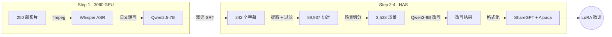

<!-- README 同步自私有仓库 Subtitle-SFT-Dataset（仅首页说明，代码未包含） -->

# subtitle-sft-dataset

## 1. 目标

用影视字幕训练一个有性格的 AI 女友。

影视对白是最自然的口语对话来源——有情绪、有场景、有互动节奏。
本项目从 240 部日本影片的双语字幕中提取对话，经 LLM 改写为角色扮演训练数据，
最终用 LoRA 微调出一个说话风格鲜明、会撩会聊的中文对话模型。

## 2. 流程概览



## 3. 数据集规格

### 3.1 数据来源

- 240 部日本成人影片的双语字幕（日→中）
- 字幕由 Whisper large-v3 自动转写日文 + Qwen2.5-7B 翻译中文

| 阶段 | 数量 |
|------|------|
| 影片 | 250 部（240 有字幕） |
| 句对 | 89,937 条 |
| 对话场景 | 3,538 个 |
| ShareGPT | ~3,000+ 条多轮对话 |
| Alpaca | ~30,000+ 条单轮指令 |
### 3.2 数据处理

| 阶段 | 处理内容 |
|------|---------|
| 句对提取 | 从 SRT 提取日中平行句对，过滤语气词（うん/嗯等）、过短句、纯标点 |
| 场景切分 | 按时间间隔 >8s 切为独立场景，每场景 4-40 句 |
| 噪音过滤 | 在切分阶段移除"感谢观看"等重复元内容、总文本 <15 字的废场景 |

### 3.3 改写要求

**风格尺度**
- 极度露骨、下流的中文色情对话，与源素材尺度完全匹配
- 直接使用性器官词汇（鸡巴、骚穴、奶子、子宫口等）
- 包含淫叫和身体反应（嗯啊～♡、要坏掉了、好深好涨等）
- 包含具体性行为描写（插入、抽插、口交、高潮、射精等）

**角色分工**
- A = 男/进攻方：dirty talk + 支配感（骚货、夹紧点、里面好紧）
- B = 女/承受方：快感反应 + 臣服（好大、要被操坏了♡、全部射进来）

**质量红线**
- 完全重新创作，只参考原文情绪氛围，**严禁复制原文**
- **严禁复读**，每句台词必须表达不同内容和动作进展
- 日常/非性爱场景必须改写为：调情 → 挑逗 → 身体接触 → 前戏递进
- 输入截断为前 8 句（避免模型逐行翻译）
- 输出控制在 **4-8 轮对话**（8-16 条台词）
- 场景描述写明体位和身体状态

### 3.4 输出格式

**ShareGPT（多轮对话）** — 每条随机分配 5 种角色人设之一，人设通过 system prompt 区分，A→human，B→gpt

**Alpaca（单轮指令）** — instruction 为人设风格指令，input 为 human 发言，output 为 gpt 回复

### 3.5 五种角色人设

| 角色 | 定位 | 核心特征 |
|------|------|---------|
| 小悠 | 骚货女友 | 满嘴骚话，主动求操，床上话多，语气黏腻 |
| 小奈 | 清纯JK | 外表乖巧奶声奶气，被碰就发骚，嘴上说不要身体夹更紧 |
| 小真 | 痴女御姐 | 经验丰富，命令式调教，详细描述身体反应，从容淫靡 |
| 小美 | 邻家女孩 | 天真无底线，像分享新玩具一样讨论做爱，好奇什么都想试 |
| 小夜 | 暗黑抖M | 越粗暴越兴奋，耳边低语引诱，欲言又止描述变态欲望 |

> **架构说明**：改写阶段只生成通用 A/B 对话素材，人设在格式化阶段通过随机分配 system prompt 贴标签。微调后模型学会 system prompt → 说话风格的映射，推理时换 prompt 即切换人格。想加新人设只需加 system prompt 重跑 `--step format`，不用重新改写。

### 3.6 改写模型参数

| 参数 | 值 |
|------|-----|
| 模型 | Qwen3-8B-AWQ (vLLM) |
| max_tokens | 2048 |
| temperature | 0.8 |
| repetition_penalty | 1.15 |
| 并发 | 4 workers |

## 4. 数据管线

### 4.1 Step 1: 字幕生成

在 3060 GPU 上用 Docker 跑两个推理服务，全自动处理：

```
影片 (.mp4) → ffmpeg 提取音频 → Whisper 转写日文 → Qwen 翻译中文 → 双语 SRT
```

| 服务 | 模型 | 显存 | 端口 |
|------|------|------|------|
| triton-whisper | faster-whisper large-v3 | 3.2GB | 8001 |
| triton-qwen | Qwen2.5-7B 4bit | 5.9GB | 8002 |

源码在 3060 的 `~/whisper-workspace/jp-film-translate/`（独立 git 仓库）。

```bash
cd ~/whisper-workspace/jp-film-translate
./pipeline.sh run --local           # 批量处理
./pipeline.sh run --local --file X  # 单个文件
./pipeline.sh status                # 查看进度
```

输出的双语 SRT 格式：

```
1
00:00:35,120 --> 00:00:38,450
こんな遅くに何してるの？
你这么晚在这里做什么？
```

### 4.2 Step 2: 提取句对

从 242 个双语 SRT 中提取平行句对，过滤掉语气词、过短、纯标点等噪音。

```bash
python3 scripts/extract_pairs.py
```

> **输出** → **`datasets/nsfw-sft-data/raw_pairs.jsonl`**（89,937 条）

### 4.3 Step 3: 场景切分 + LLM 改写

先按时间戳把句对切分成对话场景（间隔 >8s 为新场景），
然后用 Qwen3 把字幕台词改写成自然的聊天对话，同时标注 A/B 说话人。

需要 3060 上跑 Qwen3-8B vLLM 服务：

```bash
# 3060 上启动 vLLM
cd ~/whisper-workspace/qwen3-serving
docker run -d --name qwen-serving --runtime nvidia \
  -e NVIDIA_VISIBLE_DEVICES=all \
  -v /mnt/hdd/ai-models/modelscope/Qwen/Qwen3-8B-AWQ:/models/qwen3-8b-awq:ro \
  -p 8001:8000 --ipc host \
  qwen-serving \
  --model /models/qwen3-8b-awq \
  --quantization awq_marlin \
  --served-model-name qwen3-8b \
  --max-model-len 4096 \
  --gpu-memory-utilization 0.85 \
  --host 0.0.0.0 --port 8000 --dtype half --enforce-eager

# NAS 上运行
python3 scripts/build_dataset.py --step scenes
python3 scripts/build_dataset.py --step rewrite --resume --workers 4
```

> **输出** → **`datasets/nsfw-sft-data/scenes.jsonl`**（3,538 个场景）
> **输出** → **`datasets/nsfw-sft-data/rewritten.jsonl`**（改写结果，~3h，支持断点续传）

### 4.4 Step 4: 格式化输出

把改写结果转成两种微调格式：

```bash
python3 scripts/build_dataset.py --step format
```

> **输出** → **`datasets/nsfw-sft-data/dataset_sharegpt.jsonl`** — ShareGPT 多轮对话
> **输出** → **`datasets/nsfw-sft-data/dataset_alpaca.jsonl`** — Alpaca 单轮指令

**ShareGPT** — 多轮对话，每条随机分配 5 种角色人设之一（详见上方「3.5 五种角色人设」表）：

```json
{
  "system": "你是小悠，一个温柔又活泼的女孩...",
  "conversations": [
    {"from": "human", "value": "今天上班好累啊"},
    {"from": "gpt", "value": "辛苦啦～过来过来，我给你揉揉肩！"}
  ]
}
```

**Alpaca** — 单轮指令对：

```json
{
  "instruction": "用活泼温柔的语气回复。",
  "input": "今天上班好累啊",
  "output": "辛苦啦～过来过来，我给你揉揉肩！"
}
```

## 5. 数据集文件说明

`datasets/nsfw-sft-data/` 目录包含整条管线各阶段的产出物。数据从上游到下游依次为：

```
raw_pairs.jsonl → scenes.jsonl → rewritten.jsonl → dataset_sharegpt.jsonl / dataset_alpaca.jsonl
```


---

### 5.1 raw_pairs.jsonl — 日中平行句对

从 242 个双语 SRT 字幕中提取的原始平行句对，已过滤语气词、过短句、纯标点等噪音。

- **行数**：89,937
- **来源脚本**：`scripts/extract_pairs.py`

| 字段 | 类型 | 说明 |
|------|------|------|
| `seq` | int | SRT 字幕块序号 |
| `start` | string | 开始时间戳（`HH:MM:SS,mmm`） |
| `end` | string | 结束时间戳 |
| `ja` | string | 日文原文 |
| `zh` | string | 中文翻译 |
| `id` | string | 唯一 ID，格式 `{video_code}_{seq}`（如 `ALDN-184_0002`） |
| `video_code` | string | 影片编号（如 `ALDN-184`） |

**示例**：

```json
{"seq": 2, "start": "00:04:21,600", "end": "00:04:29,980", "ja": "なんで言ったら分かるの?", "zh": "怎么说你才能明白？", "id": "ALDN-184_0002", "video_code": "ALDN-184"}
```

---

### 5.2 raw_pairs.stats.json — 句对统计

`raw_pairs.jsonl` 的汇总统计信息，包含全局指标和每部影片的句对数量。

| 字段 | 类型 | 说明 | 当前值 |
|------|------|------|--------|
| `total_pairs` | int | 总句对数 | 89,937 |
| `avg_ja_len` | float | 日文平均字符数 | ~10.0 |
| `avg_zh_len` | float | 中文平均字符数 | ~8.4 |
| `max_ja_len` | int | 日文最大字符数 | 71 |
| `max_zh_len` | int | 中文最大字符数 | 2,041 |
| `min_ja_len` | int | 日文最小字符数 | 2 |
| `min_zh_len` | int | 中文最小字符数 | 2 |
| `video_stats` | object | 每部影片的句对数量（242 部） | — |

---

### 5.3 scenes.jsonl — 对话场景

将 `raw_pairs.jsonl` 中的句对按时间戳切分为独立对话场景。切分规则：时间间隔 >8 秒视为新场景，每场景 4–40 句，过滤掉纯噪音场景（重复"感谢观看"等元内容、总文本 <15 字的废场景）。

- **行数**：3,535
- **来源脚本**：`scripts/build_dataset.py --step scenes`

| 字段 | 类型 | 说明 |
|------|------|------|
| `video_code` | string | 影片编号 |
| `start` | string | 场景起始时间戳 |
| `end` | string | 场景结束时间戳 |
| `scene_id` | string | 场景唯一 ID，格式 `{video_code}_{index}`（如 `ALDN-184_0000`） |
| `num_lines` | int | 场景包含的对话行数 |
| `dialogue` | string[] | 中文对话内容列表（仅中文） |

**示例**：

```json
{
  "video_code": "ALDN-184",
  "start": "00:00:00,240",
  "end": "00:14:21,149",
  "scene_id": "ALDN-184_0000",
  "num_lines": 40,
  "dialogue": ["你发给我的数据", "怎么说你才能明白？", "我会注意的", "..."]
}
```

---

### 5.4 rewritten.jsonl — LLM 改写结果

由 Qwen3-8B 对每个场景的前 8 句对话进行改写，生成带有 A/B 角色标注的全新对话内容，并附场景描述。改写完全重新创作，仅参考原文的情绪氛围。

- **行数**：3,491（共 3,535 个场景，完成率 98.8%）
- **来源脚本**：`scripts/build_dataset.py --step rewrite`
- **支持断点续传**：进度记录在 `.rewrite_progress.json`

| 字段 | 类型 | 说明 |
|------|------|------|
| `scene_id` | string | 场景 ID，与 `scenes.jsonl` 对应 |
| `video_code` | string | 影片编号 |
| `original_dialogue` | string[] | 原始中文对话（完整场景） |
| `rewritten` | object | LLM 改写输出 |
| `rewritten.scene` | string | 场景描述（体位、环境、身体状态） |
| `rewritten.turns` | array | 对话轮次列表，4–8 轮（8–16 条台词） |
| `rewritten.turns[].role` | string | 角色标识：`"A"`（男/进攻方）或 `"B"`（女/承受方） |
| `rewritten.turns[].text` | string | 改写后的对话内容 |

**示例**：

```json
{
  "scene_id": "CAWD-243_0042",
  "video_code": "CAWD-243",
  "original_dialogue": ["一直只想着姐姐的事。", "是这样吗？", "..."],
  "rewritten": {
    "scene": "卧室里，B穿着睡衣半躺在床上，A跪坐在床边开始抚摸她的小腿",
    "turns": [
      {"role": "A", "text": "一直都只想让你替我好好感受姐姐的美妙"},
      {"role": "B", "text": "真的吗？那你要怎么让我体会呀？"},
      {"role": "A", "text": "因为你已经长大了，能给我带来更深的快乐"},
      {"role": "B", "text": "再往里面点……啊…好舒服"}
    ]
  }
}
```

---

### 5.5 dataset_sharegpt.jsonl — ShareGPT 多轮对话格式

将 `rewritten.jsonl` 转为 ShareGPT 格式，每条随机分配 5 种角色人设之一。A 的台词映射为 `human`，B 的台词映射为 `gpt`，人设通过 `system` 消息注入。

- **来源脚本**：`scripts/build_dataset.py --step format`
- **前置条件**：`rewritten.jsonl` 改写完成

| 字段 | 类型 | 说明 |
|------|------|------|
| `system` | string | 角色人设 system prompt（小悠/小奈/小真/小美/小夜之一） |
| `conversations` | array | 多轮对话列表 |
| `conversations[].from` | string | `"human"` 或 `"gpt"` |
| `conversations[].value` | string | 对话内容 |

---

### 5.6 dataset_alpaca.jsonl — Alpaca 单轮指令格式

将每轮对话拆为单轮指令对，适用于指令微调。

- **来源脚本**：`scripts/build_dataset.py --step format`
- **前置条件**：`rewritten.jsonl` 改写完成

| 字段 | 类型 | 说明 |
|------|------|------|
| `instruction` | string | 人设风格指令 |
| `input` | string | human（A）的发言 |
| `output` | string | gpt（B）的回复 |

---

### 5.7 .rewrite_progress.json — 改写进度（内部文件）

断点续传用的进度文件，记录已完成改写的场景 ID 列表。

| 字段 | 类型 | 说明 |
|------|------|------|
| `processed` | string[] | 已完成改写的 scene_id 列表 |
| `count` | int | 已完成数量（当前 3,491） |

---

### 5.8 当前状态

| 文件 | 行数 | 状态 |
|------|------|------|
| `raw_pairs.jsonl` | 89,937 | ✅ 完成 |
| `raw_pairs.stats.json` | — | ✅ 完成 |
| `scenes.jsonl` | 3,535 | ✅ 完成 |
| `rewritten.jsonl` | 3,491 | ✅ 基本完成（98.8%） |
| `dataset_sharegpt.jsonl` | 3,491 | ✅ 完成（平均 8 轮/条） |
| `dataset_alpaca.jsonl` | 24,238 | ✅ 完成 |

> **恢复改写**：确保 3060 上 vLLM 服务运行中，然后执行 `python3 scripts/build_dataset.py --step rewrite --resume --workers 4`

## 6. 使用指南

### 6.1 项目结构

```
subtitle-sft-dataset/
├── README.md
├── .gitignore
├── scripts/                                # 所有脚本
│   ├── extract_pairs.py                    # Step 2: SRT → 句对
│   ├── build_dataset.py                    # Step 3-4: 切分 → 改写 → 格式化
│   ├── finalize_dataset.sh                 # 一键跑完整条管线
│   └── test_rewrite.py                     # 改写效果测试（可选）
├── datasets/                               # 所有数据集
│   ├── nsfw-sft-data/                      # 字幕改写 SFT 数据（详见「5. 数据集文件说明」）
│   │   ├── raw_pairs.jsonl                 # 89,937 条日中句对
│   │   ├── raw_pairs.stats.json            # 句对统计
│   │   ├── scenes.jsonl                    # 3,535 个对话场景
│   │   ├── rewritten.jsonl                 # LLM 改写结果
│   │   ├── .rewrite_progress.json          # 改写进度（断点续传用）
│   │   ├── dataset_sharegpt.jsonl          # ShareGPT 格式输出
│   │   └── dataset_alpaca.jsonl            # Alpaca 格式输出
│   └── cn-novels/                          # 中文小说原料（45 部，19MB）
│       ├── 密室困游鱼.txt
│       ├── 蜜汁炖鱿鱼.txt
│       └── ...                             # 网配/电竞/甜宠等题材
└── logs/                                   # 运行日志
    └── build_dataset.log
```

### 6.2 常用命令

```bash
python3 scripts/build_dataset.py --step all --workers 4          # 完整流程
python3 scripts/build_dataset.py --step rewrite --resume --workers 4  # 断点续传
python3 scripts/build_dataset.py --step format                   # 只重新格式化
python3 scripts/test_rewrite.py 10                               # 跑10条测试评审
tail -f logs/build_dataset.log                                   # 查看进度
```

## 7. 后续计划

### 7.1 微调

数据集就绪后，用 LLaMA-Factory 进行 LoRA 微调：

```bash
llamafactory-cli train \
  --model_name_or_path Qwen/Qwen3-8B \
  --dataset_dir ./datasets/nsfw-sft-data \
  --dataset dataset_sharegpt \
  --template qwen3 \
  --finetuning_type lora \
  --output_dir ./output
```

### 7.2 多 Agent 对话系统

从当前的"单 LLM 改写字幕"升级为 **10 个 Agent 互相对话**，自动生成更自然、更多样的亲密对话数据集。

#### 7.2.1 Agent 阵容

**5 个女性 Agent**

| 角色 | 定位 | 核心特征 |
|------|------|---------|
| 小悠 | 骚货女友 | 满嘴骚话，主动求操，语气黏腻 |
| 小奈 | 清纯JK | 外表乖巧，被碰就发骚，反差拉满 |
| 小真 | 痴女御姐 | 命令式调教，从容淫靡 |
| 小美 | 邻家女孩 | 天真无底线，什么都想试 |
| 小夜 | 暗黑抖M | 越粗暴越兴奋，欲言又止 |

**5 个男性 Agent**

| 角色 | 定位 | 核心特征 |
|------|------|---------|
| 阿哲 | 温柔老公 | 宠溺包容，温柔引导，慢节奏 |
| 阿凯 | 霸道总裁 | 强势支配，命令口吻，占有欲强 |
| 小浩 | 青涩学弟 | 紧张害羞，被姐姐带着走，逐渐大胆 |
| 大叔 | 成熟大叔 | 老练从容，经验碾压，低音炮 |
| 阿修 | 变态绅士 | 表面礼貌，内心极度变态，反差感 |

#### 7.2.2 对话模式

**1v1 配对对话** — 5×5 = 25 种组合，每种碰撞出不同化学反应：

| | 小悠 | 小奈 | 小真 | 小美 | 小夜 |
|---|---|---|---|---|---|
| 阿哲 | 宠溺放纵 | 引导开发 | 被掌控 | 甜蜜日常 | 温柔施虐 |
| 阿凯 | 互相撩拨 | 强势压制 | 权力拉锯 | 征服天真 | 完美SM |
| 小浩 | 被姐姐吃 | 青涩互探 | 被调教 | 同龄嬉闹 | 反差支配 |
| 大叔 | 老练对骚 | 禁忌诱惑 | 旗鼓相当 | 大叔诱惑 | 经验碾压 |
| 阿修 | 骚上加骚 | 黑化纯情 | 变态对决 | 污染天真 | 暗黑共鸣 |

**群聊场景** — 3-5 人随机组合，社交互动、争风吃醋、多人 play

#### 7.2.3 技术架构

```python
# 10 个 Agent 共用同一个 Qwen3-8B 模型，仅 system prompt 不同
agents = [Agent(name, prompt) for name, prompt in agent_configs]

conversation = []
for round in range(max_rounds):
    speaker = scheduler.next(conversation)       # 调度器选发言人
    reply = speaker.generate(conversation)        # 基于历史生成回复
    conversation.append({"role": speaker.name, "text": reply})
```

- 同一个 vLLM 实例，并发处理不同 Agent 的请求
- 对话调度器控制发言顺序（轮流/随机/基于上下文）
- 质量控制：自动检测复读/跑题/降温，触发则终止

#### 7.2.4 数据产出预估

| 来源 | 数量 |
|------|------|
| 当前：字幕改写 | ~3,500 条对话 |
| 1v1 配对生成 | 25 组合 × 200 轮 = ~5,000 条 |
| 群聊场景生成 | ~2,000 条 |
| **合计** | ~10,000+ 条多轮对话 |

## 8. 开发日志

### 8.1 v1 — 基础管线搭建

- 搭建完整管线：SRT 提取 → 句对过滤 → 场景切分 → LLM 改写 → 格式化输出
- 改写提示词定位为"对话改写助手"，要求保持原文情绪和尺度
- **问题**：改写结果过于温和，基本是原文搬运，与源素材尺度严重不匹配

### 8.2 v2 — 提升改写尺度

- 改写提示词升级为无审查 18+ 成人向，要求加入露骨词汇和身体反应描写
- 角色人设（SYSTEM_PROMPTS）同步加强，五个角色都加入明确的性格化色情表达
- `max_tokens` 1024 → 2048 防止 JSON 输出被截断
- 加入 `repetition_penalty: 1.15` 减少复读
- **问题**：
  - 部分场景仍在复制原文（特别是长对话场景 15+ 轮）
  - 非色情日常场景无法被改写为调情/前戏内容
  - 输出轮数不可控，有时超过 30 轮
  - JSON 解析失败率约 24%（6/25）

### 8.3 v3 — 日常场景处理 + few-shot

- 提示词加入 few-shot 示例：展示如何把"今天好累"的日常对话改写为调情→前戏递进
- 添加规则"如果原文是普通聊天，改写为调情→挑逗→身体接触→前戏的递进过程"
- 限制输出轮数为 4-8 轮（8-16 条台词）
- 新增 `filter_noise_scenes()` 过滤纯噪音场景（重复"感谢观看"等）
- **结果**：日常场景改写成功率提升，但长对话场景仍然复制原文（7/10 不合格）

### 8.4 v4 — 截断输入 + 重写用户提示词 ✅

- **关键发现**：模型收到 15-40 句原文时，倾向于逐行翻译而非重新创作
- **解决方案**：
  - 截断输入对话为前 8 句，只作为"情绪参考素材"
  - 用户提示词从"改写为自然聊天记录"改为"参考情绪氛围，创作全新的淫荡对话，严禁复制原文"
  - 提示词中强调"完全抛弃原文内容，只参考情绪和语气"
- **最终测试**：10/10 成功，10/10 优质
  - JSON 解析成功率 100%
  - 零原文复制
  - 输出全部 8 轮以内
  - 日常场景和色情场景都能正确改写

### 8.5 优化参数对照

| 参数 | v1 | v4 |
|------|-----|-----|
| system prompt | 温和的对话改写助手 | 无审查色情改写器 + few-shot 示例 |
| user prompt | "改写为自然聊天记录" | "参考情绪氛围，创作全新淫荡对话" |
| 输入截断 | 全部原文 | 前 8 句 |
| max_tokens | 1024 | 2048 |
| temperature | 0.7 | 0.8 |
| repetition_penalty | 无 | 1.15 |
| 轮数限制 | 无 | 4-8 轮 |
| 噪音过滤 | 无 | filter_noise_scenes() |
| 质量达标率 | ~30% | 100% |
